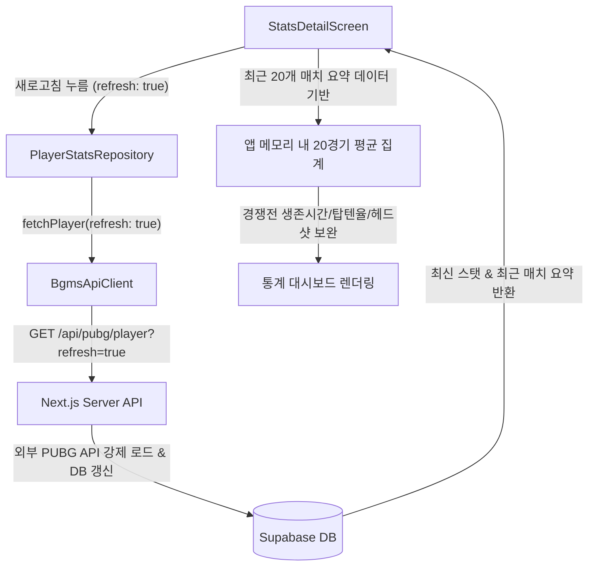

# PUBG Match History UI Upgrade Design Specification (v2.0)

본 문서는 PUBG 모바일 전적 상세 화면의 실서비스 최적화 및 프리미엄 고도화를 위한 디자인 명세서입니다. 

---

## 🎯 1. Goal (목표)
- 경쟁전(Ranked) 전적 조회 시 제공되지 않는 핵심 지표(평균 생존시간, Top 10 진입률, 헤드샷 비율)를 모바일 앱 자체에서 최근 20경기 통계를 기반으로 자동 보완 및 실시간 계산하여 출력합니다.
- 매치 카드 피드에 경과 시간("3시간 전", "2일 전")을 표시하여 유저 편의성을 극대화합니다.
- 전적 새로고침 시 외부 PUBG API 및 데이터베이스 캐시를 즉시 리프레시하는 강제 갱신 프로세스를 제공합니다.
- 사용자의 요청에 따라, 분석 완료된 매치 리포트 화면 내 불필요한 '리플레이 지도 이동' 버튼 및 관련 통합 기능을 완전히 제거합니다.

---

## 🔍 2. Scope of Changes (변경 범위)

### 2.1 경쟁전 상세 통계 지표 실시간 보완
- **집계 대상**: 최근 매치 요약 리스트 중 **분석 완료 상태(`isFallback == false`)**인 매치들의 통계 데이터.
- **계산 공식**:
  - **평균 생존시간**: `분석완료 매치의 totalSurvivalSeconds 합산 / 분석완료 매치 수` (초 단위 연산 후 `M분 S초` 포맷팅)
  - **Top 10 진입률**: `(분석완료 매치 중 rank <= 10인 매치 수 / 분석완료 매치 수) * 100` (소수점 첫째자리 포맷팅)
  - **헤드샷 비율**: `(분석완료 매치들의 headshotKills 합산 / 분석완료 매치들의 kills 합산) * 100` (소수점 첫째자리 포맷팅)
- **예외 처리**: 분석 완료된 매치가 0개인 신규 유저 등의 경우에는 해당 지표를 `N/A`로 안전하게 표시합니다.

### 2.2 최근 매치 리스트 경과 시간 노출
- **데이터 모델**: `MatchSummary` 모델 클래스에 `createdAt` (DateTime) 필드를 추가하고, API 응답의 `createdAt` 또는 `matchInfo.date`를 정상적으로 파싱해 채워 넣습니다.
- **UI 노출**: `_MatchCard` 위젯 좌측 상단 맵/모드 텍스트 라인 영역에 **"방금 전", "N분 전", "N시간 전", "N일 전"** 형태의 경과 시간을 계산하여 은은하게 표시합니다.

### 2.3 미라마 맵코드 및 맵 식별 오류 수정
- 백엔드에서 맵 식별자가 소문자(`desert_main` 등)로 넘어올 때 매핑 룩업 실패로 `'erangel'`로 떨어지는 것을 방지하기 위해 모바일 앱 단의 `mapId` 파싱을 정규화합니다.
- `MatchDetail` 파싱 및 화면의 `_getMapGradient` 등에서 `desert` 키워드도 Miramar 테마로 매칭되도록 대응 강도를 높입니다.

### 2.4 실시간 전적 갱신(새로고침) 프로세스 보완
- **레포지토리/API 클라이언트**: `PlayerStatsRepository.fetchPlayerStats` 및 `BgmsApiClient.fetchPlayer` 메서드 매개변수에 `bool refresh` 파라미터를 추가합니다.
- **새로고침 버튼 동작**: 전적 상세 화면 우측 상단의 새로고침 아이콘 터치 시 `refresh: true`를 전송하여 백엔드 데이터베이스 캐시를 무효화하고 PUBG API의 최신 실시간 정보를 강제 로드하도록 동작 흐름을 개선합니다.

### 2.5 매치 분석 리포트 내 리플레이 기능 제거 [USER FEEDBACK]
- **대상 화면**: `match_detail_screen.dart` (`MatchDetailScreen`)
- **삭제 항목**: 
  - 화면 하단의 '리플레이 지도에서 동선 확인' 버튼 및 관련 `_openMap` 내비게이션 콜백 함수.
  - 리플레이 관련 안내 텍스트나 인디케이터가 존재할 경우 함께 정리합니다.

---

## 🛠️ 3. Component & Data Flow Changes (컴포넌트 및 데이터 흐름 변경)

---

## 🧪 4. Verification Plan (검증 계획)

### 4.1 Automated Tests (자동화 테스트)
- `test/player_stats_models_test.dart`에 `MatchSummary` 날짜(`createdAt`) 파싱 테스트 케이스 추가.
- `test/features/stats/stats_detail_screen_test.dart`에 20경기 기반 경쟁전 스탯 평균 집계 로직이 0 또는 N/A가 아닌 정상 수치로 보완되는지 검증하는 위젯 테스트 시나리오 구현.
- `flutter test` 및 `dart analyze`의 무오류 성공 보장.

### 4.2 Manual Verification (수동 검증)
- 전적 화면 진입 후 새로고침 시 정상적으로 로딩 바가 나타나며 전적이 실시간 갱신되는지 확인.
- 미라마 맵의 매치 클릭 후 상세 진입 시 맵코드에 `erangel` 대신 `miramar` (또는 `Desert_Main`)가 올바르게 나오는지 확인.
- 매치 분석 리포트 화면 최하단에 리플레이 지도 이동 버튼이 깔끔하게 제거되었는지 확인.
